# Left vs Right Fist Motor Imagery

## Tools Used
- For Preprocessing & Visualization,  MATLAB via **EEGLAB**(Filtering, Rereferecing, ICA Decomposition)
- For Feature Extraction & Classification, MATLAB via **BCILAB** (Common Spatial Patterns, BCI approach definition, and LDA classifier training)
---
## Dataset
- **Source:** [NEMAR Dataset on004362](https://nemar.org/dataset/on004362)
- **Subject:** Subject 002
- **Runs Selected:** Runs 4, 8, and 12 (Left vs. Right fist motor imagery tasks)
### Event Markers
| Marker | Description |
| :---: | :--- |
| `T0` | Rest |
| `T1` | Left fist imagery onset |
| `T2` | Right fist imagery onset |
---
## Preprocessing
Raw Data → Interpolation (T7) → High-Pass Filter (1 Hz) → CAR → Extended Infomax ICA → Artifact Component Rejection → Visualisation
### 1. Channel Inspection & Bad Channel Interpolation
Initial time-series evaluation (`eegplot` / channel scroll) revealed high-amplitude, high-frequency noise isolated to electrode **T7**, which was not shared by neighboring channels. T7 was identified as a bad channel and was interpolated. The plot also showed eye blink artefacts clearly visible on the frontal Fp electrodes

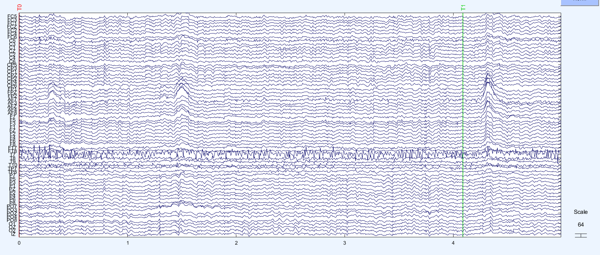
*Figure 1: Initial channel time series displaying isolated noise on electrode T7, and channel noise on frontal electrodes fp1, fp2, fpz*
### 2. Filtering & Rereferencing
- **High-Pass Filter:** Filtered at **1 Hz** to eliminate slow drifts and low-frequency artifacts.
- **Reference:** Common Average Referencing (**CAR**).
### 3. Independent Component Analysis (ICA)
Decomposition was performed using **Extended Infomax ICA** (`'extended', 1`). A total of 29 artifactual components were identified using visual inspection using eye (spectral, temporal and spatial) and removed:
`[1, 2, 22, 23, 24, 25, 26, 27, 29, 31, 34, 35, 38, 39, 41, 42, 45, 46, 47, 48, 52, 53, 56, 57, 58, 59, 60, 61, 62]`
#### Some of the Rejected Components (See the dataset for all rejected components)
| Component | Type | Topoplot | ERP Image | Power Spectrum | Description |
| :--- | :--- | :---: | :---: | :---: | :--- |
| **IC 1** | Eye Blink | 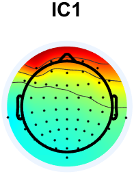 | 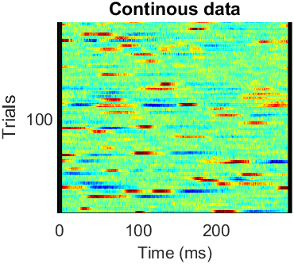 | 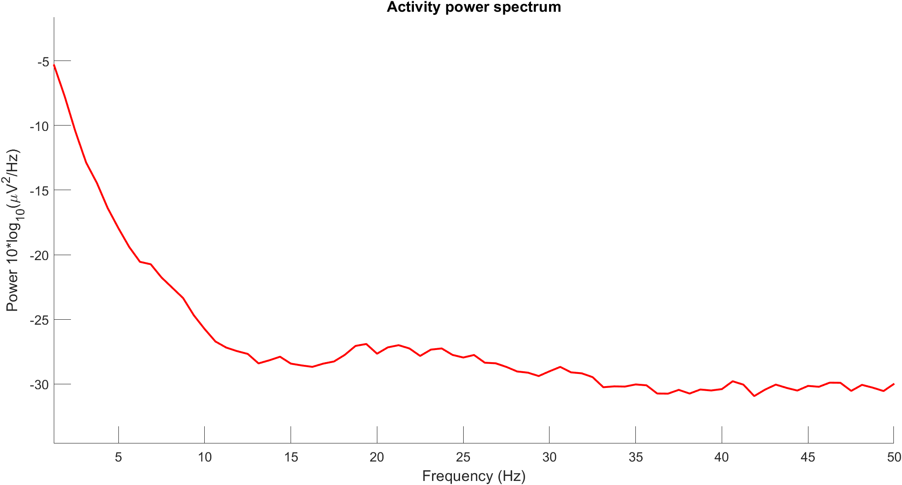 | Equal frontal electrode distribution over both orbits; sharp transient peaks in the ERP image; lack of expected mu (7–14 Hz) or beta (18–30 Hz) rhythm peaks. |
| **IC 2** | Lateral Eye Movement | 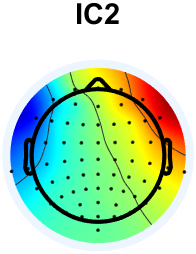 | 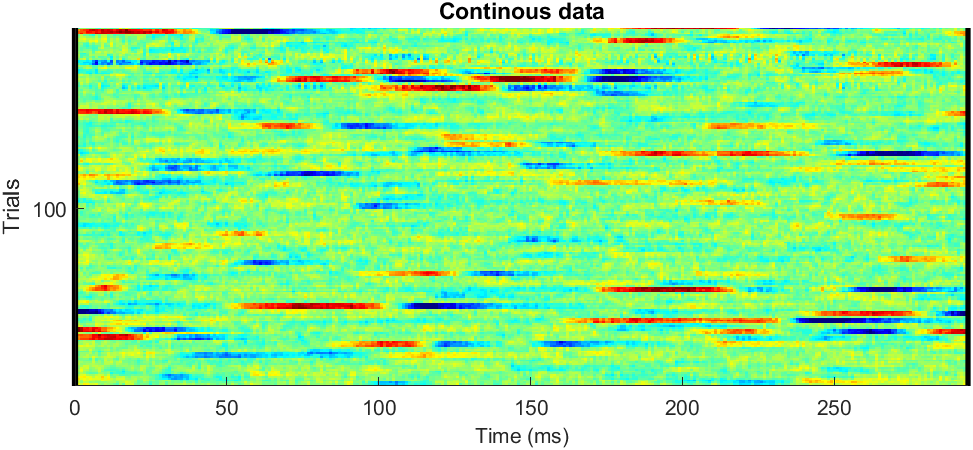 | 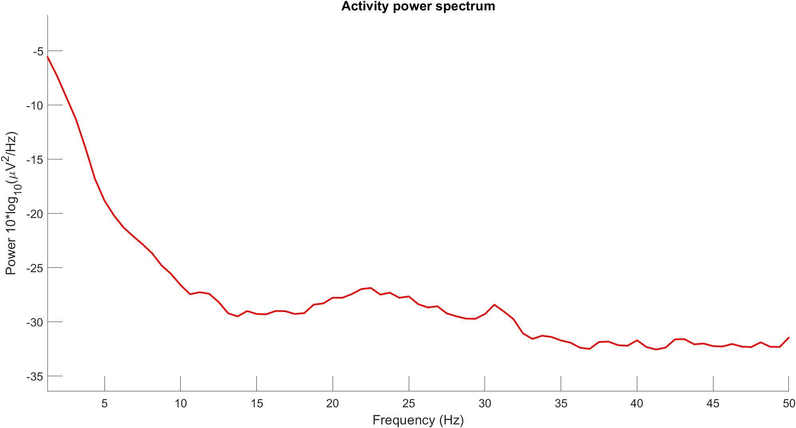 | Clear horizontal dipole across frontal electrodes (opposing polarities); typical ocular tracking dynamics with no spectral mu/beta profile. |
| **IC 22** | Muscle Artifact | 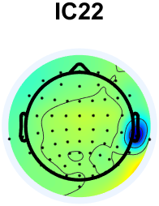 | 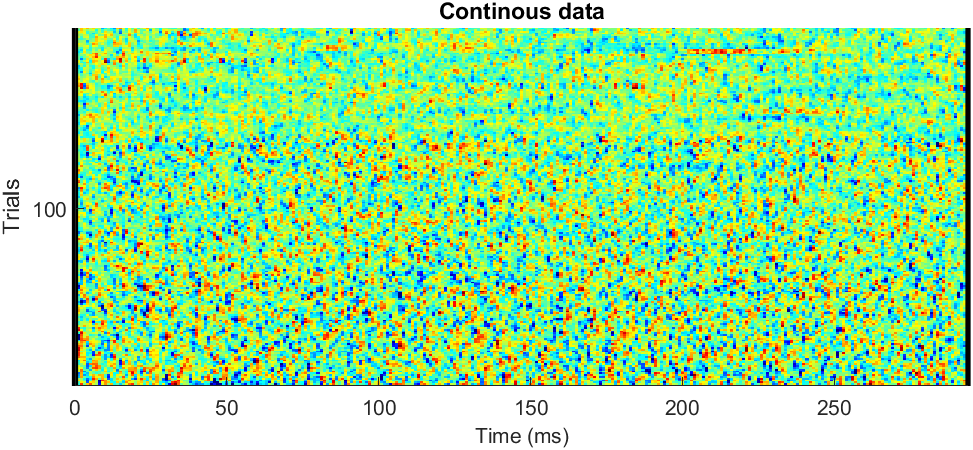 | 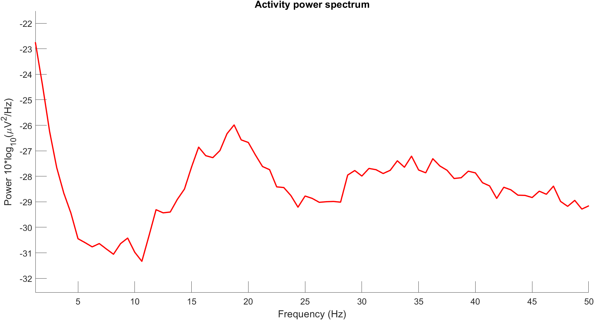 | Localized unilateral temporal projection near jaw/ear; broad high-frequency spectral elevation characteristic of EMG activity. |
| **IC 38** | Channel Noise | 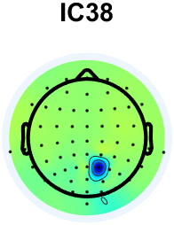 | 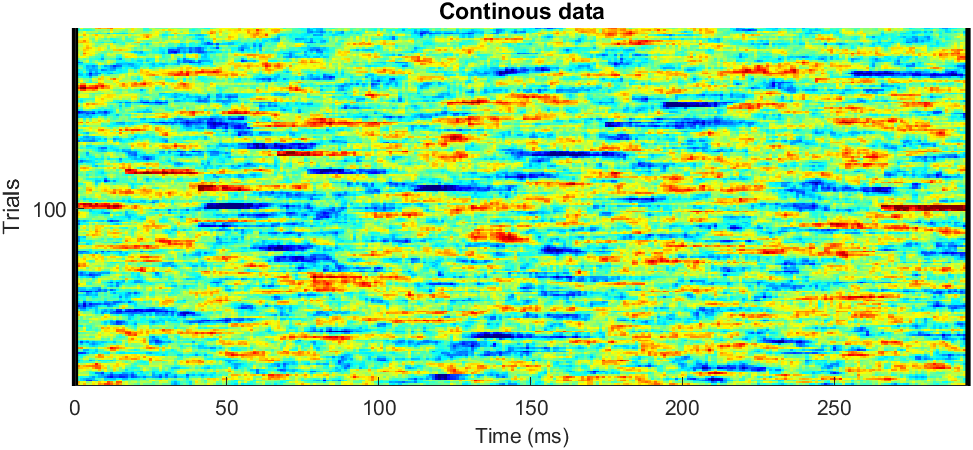 | 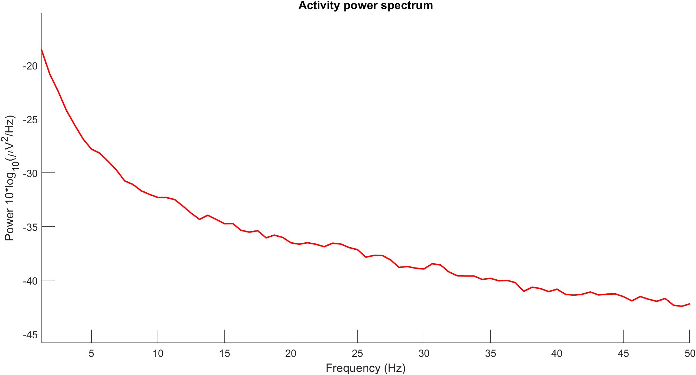 | Sharp focus on a single electrode projection with a monotonic power roll-off, consistent with residual channel-specific noise. |
---

## 5. Visualizations
### Post-ICA Cleaned Continuous Data
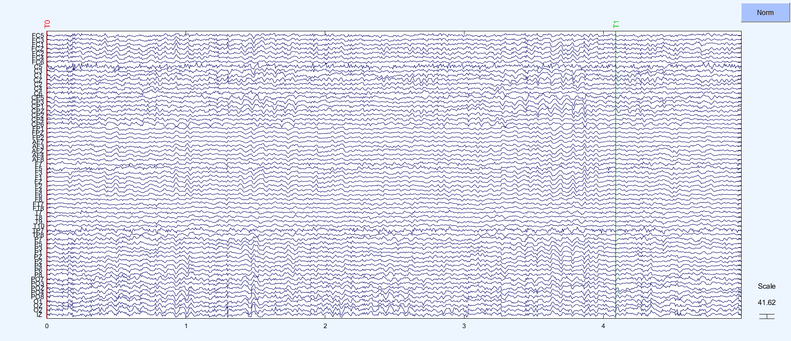
 *Figure 2: Time-series plot after artifacts removal using ICA, showing no observable eye-blink or muscle artifacts afterwards.*
### Class Specific
The continuous data was segmented into class-specific epochs based on markers **T1** (Left Fist) and **T2** (Right Fist) to analyze sensorimotor rhythms (mu: 8–13 Hz, beta: 18–30 Hz) and Event-Related Desynchronization/Synchronization (ERD/ERS).
### Class T1: Left Fist Motor Imagery
#### Topographical Maps
Contralateral desynchronization is prominently observable across the right motor cortex (C4 area).
| 11 Hz | 12 Hz | 13 Hz | 14 Hz |
| :---: | :---: | :---: | :---: |
| 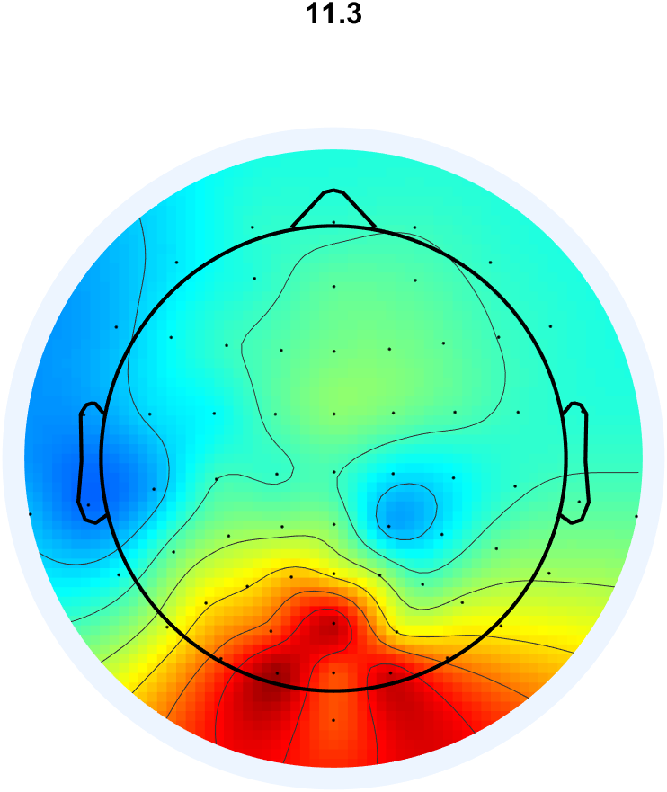 | 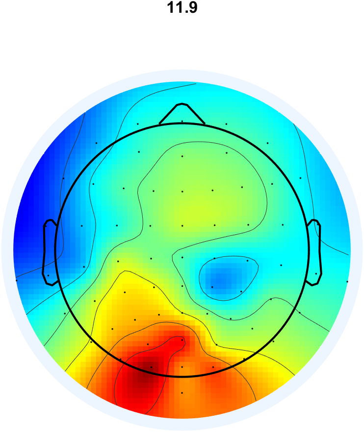 | 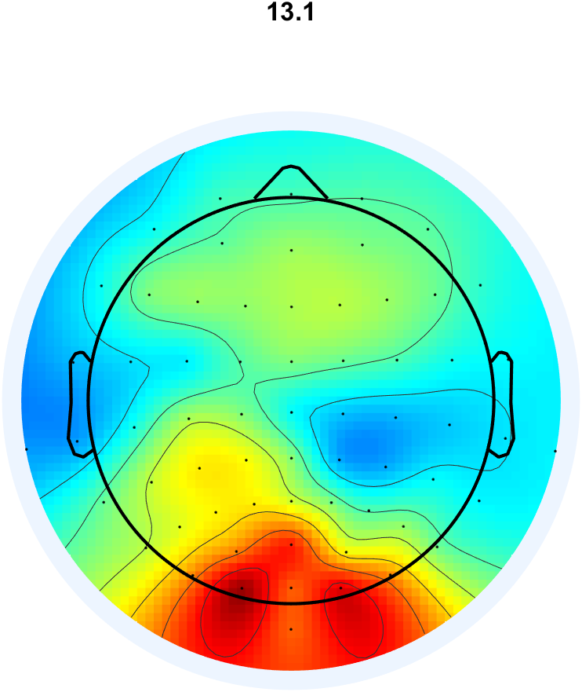 | 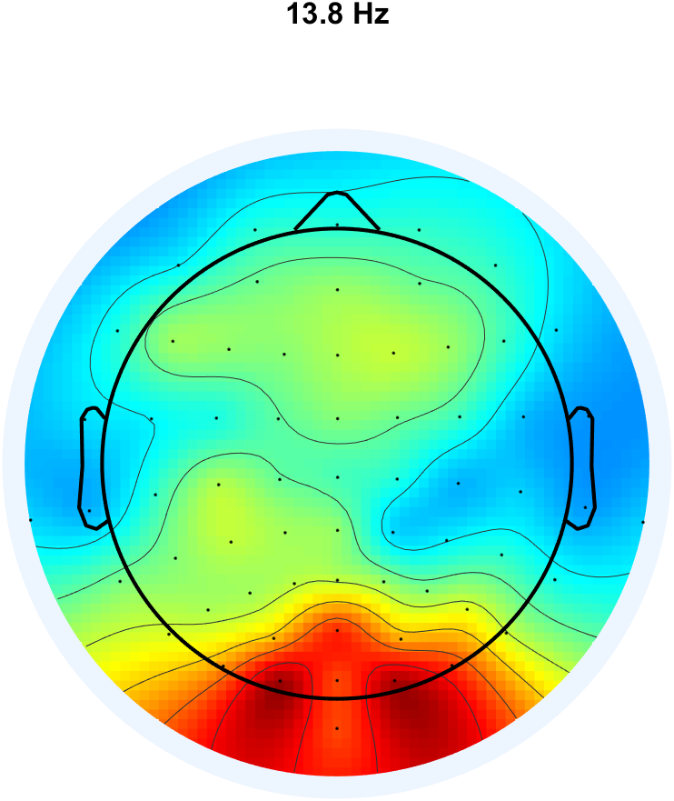 |
#### Spectral Power & Time-Frequency(ERSP) Plots (C3 vs. C4)
| Metric | Electrode C3 (Ipsilateral) | Electrode C4 (Contralateral) | Observation |
| :--- | :---: | :---: | :--- |
| **Power Spectrum** | 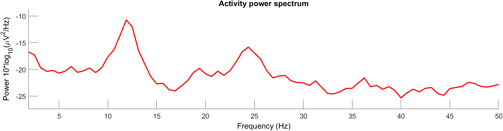 | 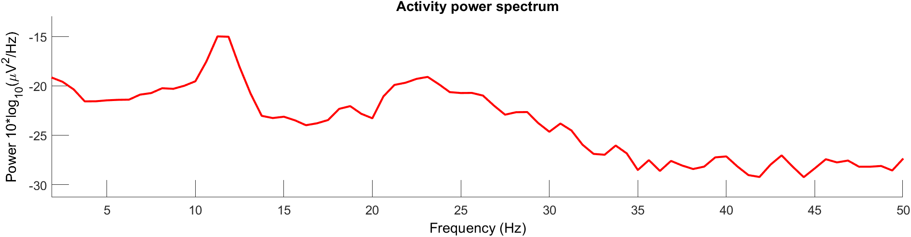 | Reduced ~10 Hz spectral power at C4 relative to C3, validating expected contralateral mu-desynchronisation. |
| **ERSP** | 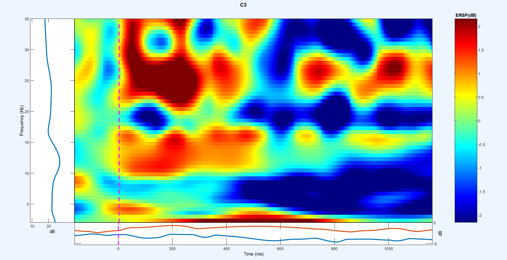 | 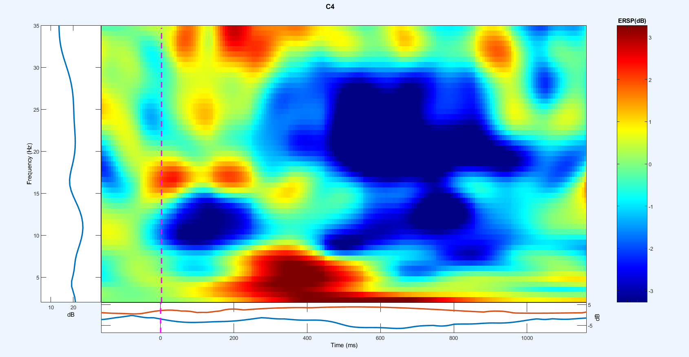 | Visible post-stimulus power drop (blue intensity) at C4 in the 500–1000 ms window across mu and beta bands. |
---
### Class T2: Right Fist Motor Imagery
#### Topographical Maps (Mu Band)
Atypical topography: localized right-hemisphere desynchronization persists despite right-hand execution, alongside apparent broad-band volume conduction across central channels.
| 11 Hz | 12 Hz | 13 Hz | 14 Hz |
| :---: | :---: | :---: | :---: |
|  |  |  |  |
#### Spectral Power & Time-Frequency Dynamics (C3 vs. C4)
| Metric | Electrode C3 (Contralateral) | Electrode C4 (Ipsilateral) | Observation |
| :--- | :---: | :---: | :--- |
| **Power Spectrum** |  |  | C3 exhibits higher power than C4, deviating from expected contralateral attenuation. |
| **ERSP** |  |  | Persistent desynchronization concentrated over C4 (right hemisphere) within mu and beta ranges rather than the expected C3 activation. |
---
## Feature Extraction & Classification (BCILAB)
- **Algorithm:** Common Spatial Pattern (CSP) filter extraction targeting sensorimotor rhythm frequency bins (8–30 Hz).
- **Classifier:** Regularized Linear Discriminant Analysis (LDA).
- **Cross-Validation Scheme:** 10-fold cross-validation across concatenated runs 4, 8, and 12.
---
## Repository Structure
