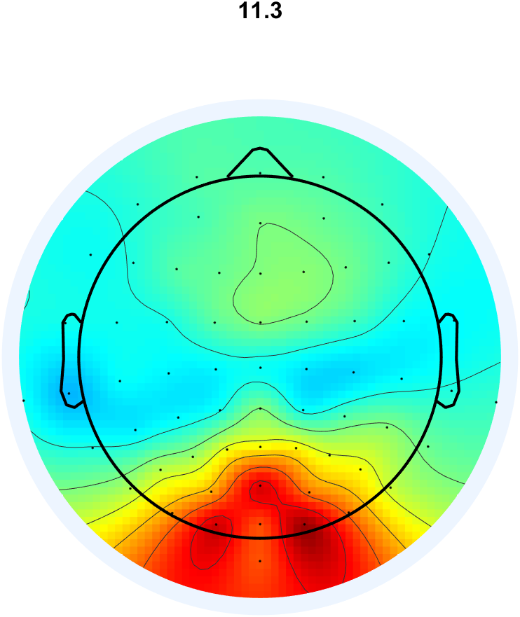
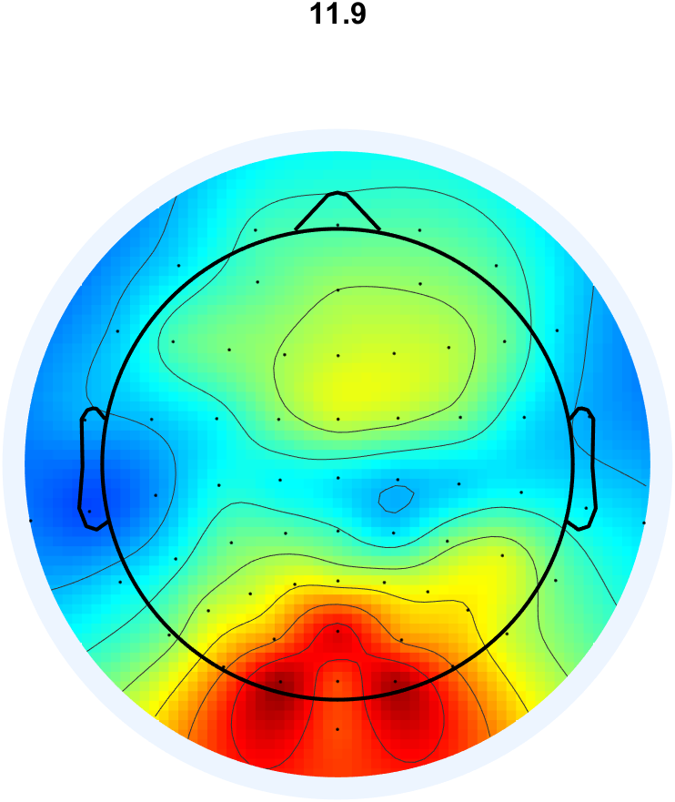
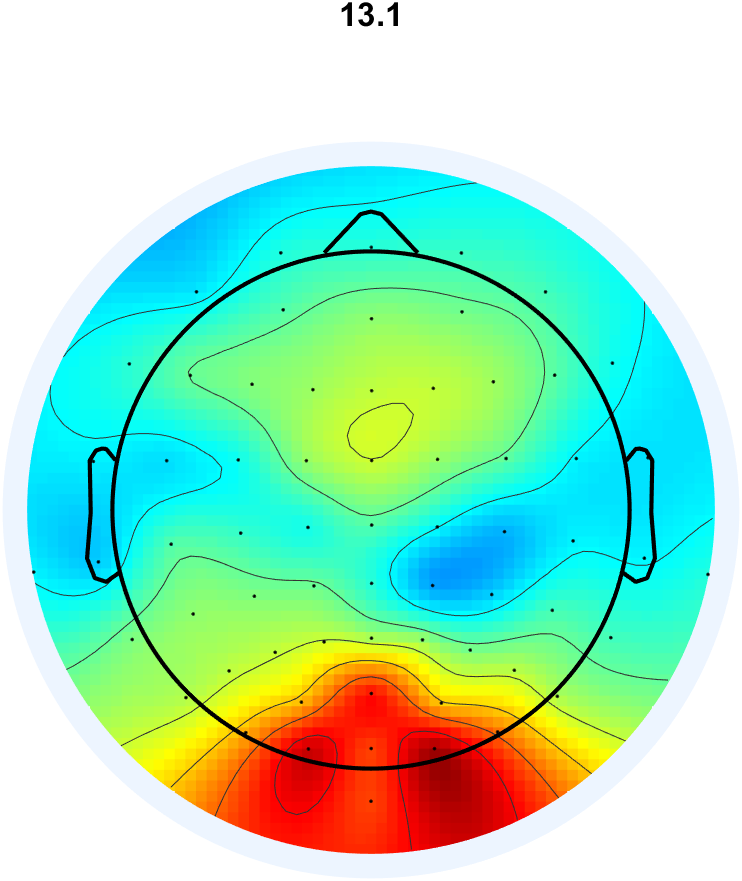
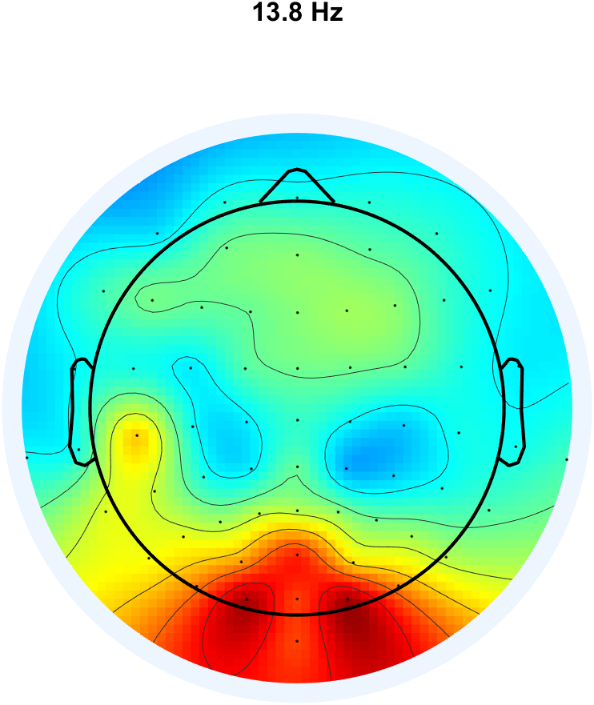
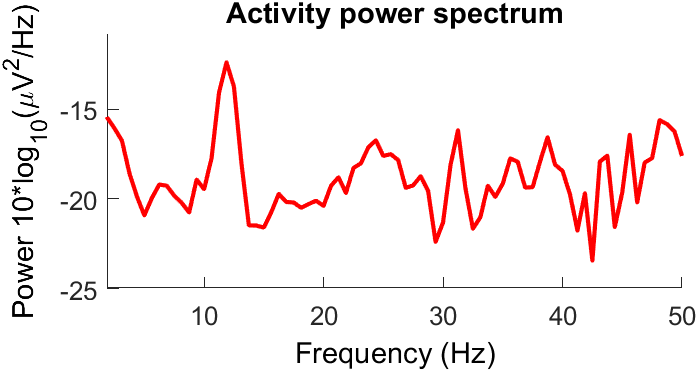
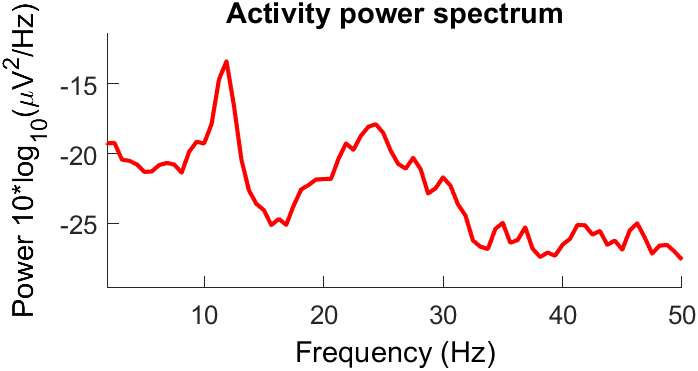
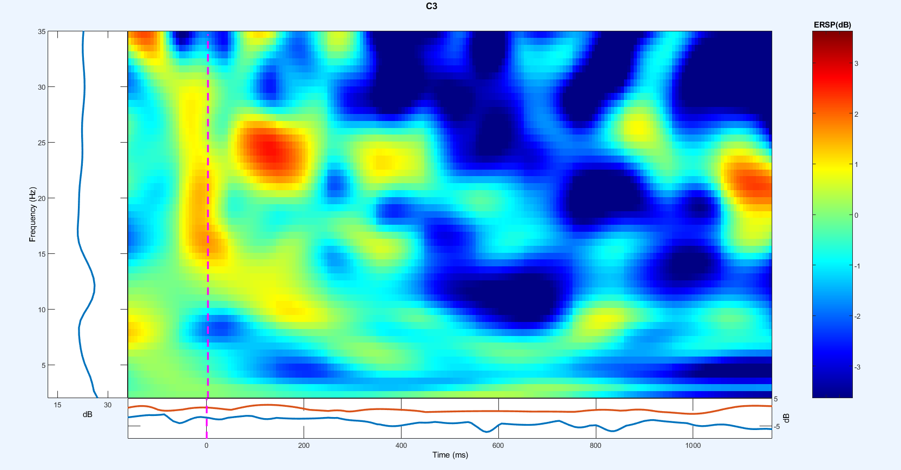
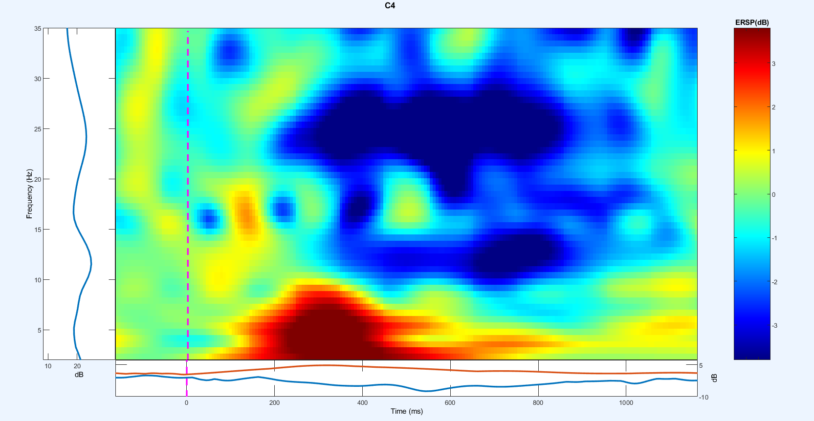

# Left vs Right Fist Motor Imagery

## Tools Used
- For Preprocessing & Visualization,  MATLAB via **EEGLAB** (Filtering, Rereferecing, Artefact_removal)
- For Feature Extraction & Classification, MATLAB via **BCILAB** (BCI approach definition, Classifier training)

---

## Dataset
- **Source:** [NEMAR Dataset on004362](https://nemar.org/dataset/on004362)
- **Subject:** Subject 002
- **Runs Selected:** Runs 4, 8, and 12 (Left vs. Right fist motor imagery tasks)

### Event Markers
| Marker | Description |
| :---: | :--- |
| `T0` | Rest |
| `T1` | Left fist imagery onset |
| `T2` | Right fist imagery onset |

---

## Preprocessing
Raw Data → Interpolation (T7) → High-Pass Filter (1 Hz) → CAR → Extended Infomax ICA → Artifact Component Rejection → Visualisation

### 1. Channel Inspection & Bad Channel Interpolation
Initial time-series evaluation (`eegplot` / channel scroll) revealed high-amplitude, high-frequency noise isolated to electrode **T7**, which was not shared by neighboring channels. T7 was identified as a bad channel and was interpolated. The plot also showed eye blink artefacts clearly visible on the frontal Fp electrodes


*Figure 1: Initial channel time series displaying isolated noise on electrode T7, and eye blink artefacts on frontal electrodes fp1, fp2, fpz*

### 2. Filtering & Rereferencing
- **High-Pass Filter:** Filtered at **1 Hz** to eliminate slow drifts and low-frequency artifacts.
- **Reference:** Common Average Referencing (**CAR**).

### 3. Independent Component Analysis (ICA)
Decomposition was performed using **Extended Infomax ICA** (`'extended', 1`). A total of 29 artifactual components were identified using visual inspection using eye (spectral, temporal and spatial) and removed:
`[1, 2, 22, 23, 24, 25, 26, 27, 29, 31, 34, 35, 38, 39, 41, 42, 45, 46, 47, 48, 52, 53, 56, 57, 58, 59, 60, 61, 62]`

#### Some of the Rejected Components (See the dataset for all rejected components)
| Component | Type | Topoplot | ERP Image | Power Spectrum | Description |
| :--- | :--- | :---: | :---: | :---: | :--- |
| **IC 1** | Eye Blink |  |  |  | Equal frontal electrode distribution over both orbits; sharp transient peaks in the ERP image; lack of expected mu (7–14 Hz) or beta (18–30 Hz) rhythm peaks. |
| **IC 2** | Lateral Eye Movement |  |  |  | Clear horizontal dipole across frontal electrodes (opposing polarities); typical ocular tracking dynamics with no spectral mu/beta profile. |
| **IC 22** | Muscle Artifact |  |  |  | Localized unilateral temporal projection near jaw/ear; broad high-frequency spectral elevation characteristic of EMG activity. |
| **IC 38** | Channel Noise |  |  |  | Sharp focus on a single electrode projection with a monotonic power roll-off, consistent with residual channel-specific noise. |

---

## 4. Visualizations

### Post-ICA Cleaned Continuous Data

*Figure 2: Time-series plot after artifacts removal using ICA, showing no observable eye-blink or muscle artifacts afterwards.*

### Class Specific
The continuous data was segmented into class-specific epochs based on markers **T1** (Left Fist) and **T2** (Right Fist) to analyze sensorimotor rhythms (mu: 8–13 Hz, beta: 18–30 Hz) and Event-Related Desynchronization/Synchronization (ERD/ERS).

### Class T1: Left Fist Motor Imagery

#### Topographical Maps
Contralateral desynchronization is prominently observable across the right motor cortex (C4 area).

| 11 Hz | 12 Hz | 13 Hz | 14 Hz |
| :---: | :---: | :---: | :---: |
|  |  |  |  |

#### Spectral Power & Time-Frequency(ERSP) Plots (C3 vs. C4)
| Metric | Electrode C3 (Ipsilateral) | Electrode C4 (Contralateral) | Observation |
| :--- | :---: | :---: | :--- |
| **Power Spectrum** |  |  | Reduced 10 Hz spectral power at C4 relative to C3, validating expected contralateral mu-desynchronisation. |
| **ERSP** |  |  | Visible post-stimulus power drop (blue intensity) at C4 in the 500–1000 ms window across mu and beta bands. |

---

### Class T2: Right Fist Motor Imagery

#### Topographical Maps (Mu Band)
Atypical topography right-hemisphere desynchronization is seen despite right-hand execution, alongside apparent broad-band volume conduction across the motor cortex area.

| 11 Hz | 12 Hz | 13 Hz | 14 Hz |
| :---: | :---: | :---: | :---: |
|  |  |  |  |

#### Spectral Power & Time-Frequency Dynamics (C3 vs. C4)
| Metric | Electrode C3 (Contralateral) | Electrode C4 (Ipsilateral) | Observation |
| :--- | :---: | :---: | :--- |
| **Power Spectrum** |  |  | C3 exhibits slightly higher power compared to C4 |
| **ERSP** |  |  | desynchronization concentrated over C4 within mu and beta ranges rather than the expected C3 activation. |

---

## 5. Feature Extraction & Classification (BCILAB)

### 1. Data Selection and Channel Subsetting
Continuous EEG data following preprocessing and ICA artifact pruning (`6 - Filtered, T7 Interpolated, Avg_Rereferenced, ICA_Weights, Pruned_with_ICA.set`) was utilized for binary classification between left-fist (**T1**) and right-fist (**T2**) motor imagery.

Before feeding the signals into the classifier pipeline, the electrodes responsible for motor cortex activation during left- and right-fist motor imagery were identified:
* `FC3`, `FCZ`, `FC4`
* `C5`, `C3`, `C1`, `CZ`, `C2`, `C4`, `C6`
* `CP3`, `CPZ`, `CP4`

To prevent peripheral artifacts from dominating spatial filtering, a dedicated dataset containing exclusively these 13 sensorimotor channels was generated, unified into a single `.set` file, and loaded into MATLAB using BCCILAB functions.

### 2. Feature Extraction and Model Training
Common Spatial Pattern (CSP) filtering was applied to maximize the variance ratio between the two motor imagery conditions:
* **Spectral Filter:** Minimum-phase FIR filter tuned to sensorimotor mu and beta bands ([6 8 28 32] Hz).
* **Epoch Window:** 0.5 s to 3.5 s relative to trial cue onset at 0.0 s.
* **Pattern Pairs:** 2 pattern pairs (4 patterns total) were extracted. The pattern count was reduced to 2 instead of 3 due to reduced number of channels.
* **Classifier:** Linear Discriminant Analysis (LDA) evaluated via 5-fold cross-validation.

### 3. Classification Performance

Restricting the analysis to the sensorimotor strip eliminated artifactual variance and yielded a cross-validated performance of **88.89% mean accuracy**, instead of 70% previously with all channels.

| Metric | Cross-Validation Score (N=5) |
| :--- | :--- |
| **Mean Accuracy** | **88.89%** (Error Rate: 0.111 ± 0.111) |
| **True Positive Rate (T1 / Left Fist)** | **0.810 ± 0.207** |
| **True Negative Rate (T2 / Right Fist)** | **0.960 ± 0.089** |
| **False Positive Rate** | **0.040 ± 0.089** |
| **False Negative Rate** | **0.190 ± 0.207** |

#### Fold-by-Fold Breakdown
* **Fold 1:** Accuracy: 88.89% | TPR: 0.8000 | TNR: 1.0000 | Error Rate: 0.1111
* **Fold 2:** Accuracy: **100.0%** | TPR: 1.0000 | TNR: 1.0000 | Error Rate: 0.0000
* **Fold 3:** Accuracy: **100.0%** | TPR: 1.0000 | TNR: 1.0000 | Error Rate: 0.0000
* **Fold 4:** Accuracy: 77.78% | TPR: 0.7500 | TNR: 0.8000 | Error Rate: 0.2222
* **Fold 5:** Accuracy: 77.78% | TPR: 0.5000 | TNR: 1.0000 | Error Rate: 0.2222

### 4. Spatial Pattern Validation

Because the dataset was restricted to a 13-channel central grid without peripheral anchor electrodes, standard 2D scalp interpolations auto-scale and distort across the head cartoon. Rather than relying solely on visual inspection of deformed topoplots, the forward-model spatial projection weights ($a = (W^{-1})^T$) were extracted and analyzed numerically:

```text
======================== CSP PATTERNS MATRIX ========================
Electrode  | Pattern 1    | Pattern 2    | Pattern 3    | Pattern 4    
--------------------------------------------------------------
FC3        |      -3.4888 |      +0.2096 |      -5.1974 |      -1.0043
FCZ        |      -5.8258 |      -0.5243 |      -5.7227 |      +2.0921
FC4        |      -4.6494 |      +0.0313 |      -3.8504 |      +2.4215
C5         |      -1.8241 |      -6.1516 |      -1.0438 |      -3.3063
C3         |      -2.5962 |      +1.2839 |      -3.1542 |      -6.0726
C1         |      -2.9317 |      +0.0395 |      -3.3472 |      -5.3184
CZ         |      -3.6093 |      -0.3414 |      -3.5323 |      -2.2218
C2         |      -2.7251 |      +0.1903 |      -1.8187 |      -0.2545
C4         |      -1.6815 |      +1.0156 |      -2.0550 |      +1.0975
C6         |      +2.4071 |      +0.8796 |      -1.4073 |      +1.8040
CP3        |      -1.2895 |      +1.5832 |      +3.4520 |      -6.9966
CPZ        |      -0.3088 |      +0.0743 |      +1.5768 |      -4.1325
CP4        |      +4.0367 |      +1.4953 |      +0.6608 |      -0.0536
==============================================================
```

In CSP, eigenvector polarities are mathematically arbitrary; absolute magnitude $|a|$ reflects the strength of the underlying neural source:

* **Pattern 4 (Right Fist / T2):** Confirms clear contralateral left sensorimotor activation. The negative pole peaks sharply over the left motor cortex at **`CP3` (-6.9966)**, **`C3` (-6.0726)**, and **`C1` (-5.3184)**, while the ipsilateral right hemisphere remains near baseline (**`CP4` at -0.0536**).

* **Pattern 3 (Right Fist / T2):** Identifies an anteroposterior dipole spanning between frontocentral premotor areas (**`FCZ` -5.7227**, **`FC3` -5.1974**) and centroparietal somatosensory electrodes (**`CP3` +3.4520**).
  
* **Pattern 1 (Left Fist / T1):** Isolates the contralateral right hemisphere, with primary positive activation focused over **`CP4` (+4.0367)** and **`C6` (+2.4071)**, opposing anterior midline activity (**`FCZ` -5.8258**).
  
* **Pattern 2 (Left Fist / T1):** Functions as a lateral reference component, isolating left-lateral motor strip power (**`C5` -6.1516**) to suppress non-task-specific bilateral activity.

> [!NOTE]
> The numerical weights verify that the 88.89% classification accuracy is grounded in physiologically valid, contralateral sensorimotor rhythm modulation rather than artifacts.

---

## Repository Structure

```text
Motor_Imagery(Left vs Right Fist)/
├── Figures/
│   ├── 1.png
│   ├── 2.png
│   ├── Components/
│   │   ├── 1/
│   │   │   ├── ERP_Image.png
│   │   │   ├── Power_Spectrum.png
│   │   │   └── Topoplot.png
│   │   ├── 2/
│   │   │   ├── ERP_Image.png
│   │   │   ├── Power_Spectrum.png
│   │   │   └── Topoplot.png
│   │   ├── 22/
│   │   │   ├── ERP_Image.png
│   │   │   ├── Power_Spectrum.png
│   │   │   └── Topoplot.png
│   │   └── 38/
│   │       ├── ERP_Image.png
│   │       ├── Power_Spectrum.png
│   │       └── Topoplot.png
│   ├── T1/
│   │   ├── ERSP_Plots/
│   │   │   ├── C3.png
│   │   │   └── C4.png
│   │   ├── Power_Spectrum/
│   │   │   ├── C3.png
│   │   │   └── C4.png
│   │   └── Topoplots/
│   │       ├── 11Hz.png
│   │       ├── 12Hz.png
│   │       ├── 13Hz.png
│   │       └── 14Hz.png
│   └── T2/
│       ├── ERSP_Plots/
│       │   ├── C3.png
│       │   └── C4.png
│       ├── Power_Spectrum/
│       │   ├── C3.png
│       │   └── C4.png
│       └── Topoplots/
│           ├── 11Hz.png
│           ├── 12Hz.png
│           ├── 13Hz.png
│           └── 14Hz.png
├── Scripts/
│   ├── Datasets/
│   │   ├── 1 - Original Dataset.fdt
│   │   ├── 1 - Original Dataset.set
│   │   ├── 2Filtered.fdt
│   │   ├── 2Filtered.set
│   │   ├── 3Filtered, T7 Interpolated.fdt
│   │   ├── 3Filtered, T7 Interpolated.set
│   │   ├── 4Filtered, T7 Interpolated, Avg_Rereferenced.fdt
│   │   ├── 4Filtered, T7 Interpolated, Avg_Rereferenced.set
│   │   ├── 5Filtered, T7 Interpolated, Avg_Rereferenced, ICA_Weights.fdt
│   │   ├── 5Filtered, T7 Interpolated, Avg_Rereferenced, ICA_Weights.set
│   │   ├── 6Filtered,T7Interpolated,Avg_Rereferenced,ICA_Weights,Pruned_with_ICA.fdt
│   │   ├── 6Filtered,T7Interpolated,Avg_Rereferenced,ICA_Weights,Pruned_with_ICA.set
│   │   ├── 7T1_Left_Epochs_Only.fdt
│   │   ├── 7T1_Left_Epochs_Only.set
│   │   ├── 8T2_Right_Epochs_Only.fdt
│   │   └── 8T2_Right_Epochs_Only.set
│   ├── Trained_Model_Weights/
│   │   └── Readme.md
│   ├── BCI_Approach_and_Classifier_Training.m
│   ├── Creating_13_Channel_dataset.m
│   ├── Preprocessing.m
│   ├── Visualisations.m
│   └── Readme.md
└── Readme.md
```
